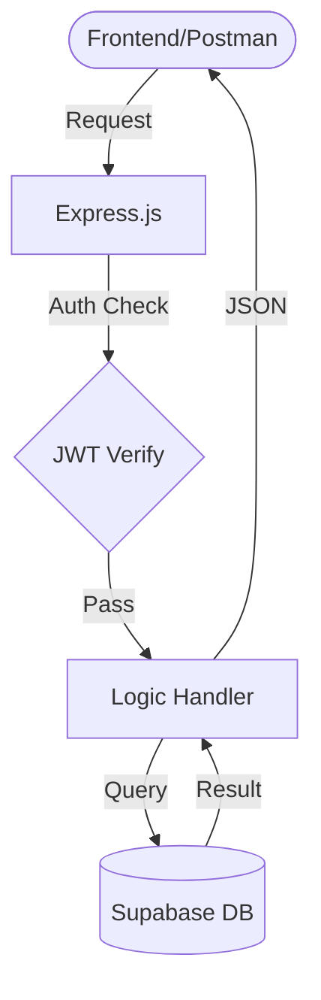

# Volunteer Opportunities Hub - Backend

Welcome to the **Volunteer Opportunities Hub Backend**, a robust, secure, and scalable API built to connect volunteers with local organizations. This project handles user authentication, opportunity discovery, waitlist management, in-app messaging, and administrative oversight.

---

## 📖 1. Project Overview
The Volunteer Opportunities Hub is a digital platform designed to bridge the gap between hearts and hands. The backend provides a centralized engine for:
*   **Volunteers**: To find, join, and track their service hours.
*   **Organizations**: To post shifts, manage volunteers, and communicate with teams.
*   **Admins**: To verify data integrity, moderate content, and generate impact reports.

This backend is built with a focus on **Security**, **Data Integrity**, and **Automation**.

---

## 🛠️ 2. Tech Stack
| Component | Technology | Purpose |
| :--- | :--- | :--- |
| **Runtime** | Node.js | Fast, scalable event-driven environment. |
| **Framework** | Express.js | Lightweight routing and middleware management. |
| **Database** | Supabase (PostgreSQL) | Real-time data storage and relation management. |
| **Authentication** | JWT & Supabase Auth | Secure, token-based identity verification. |
| **Security** | bcryptjs / dotenv | Password hashing and secret management. |
| **Utilities** | CORS / Morgan / CSV | Cross-origin support, logging, and data exports. |

---

## � 3. Database Schema Explanation
The database is structured into 8 core tables with **Relational Integrity** and **Row Level Security (RLS)**:

1.  **`profiles`**: Extends auth users with bio, skills, and roles (Admin/Org/Volunteer).
2.  **`opportunities`**: The "Heart" of the app, storing dates, locations, and capacity.
3.  **`volunteer_logs`**: Tracks the lifecycle of a volunteer action (Joined -> Waitlisted -> Completed).
4.  **`reviews`**: One-to-one event feedback ensuring 100% data fairness.
5.  **`groups` & `group_members`**: Enables community-led coordination and team hours.
6.  **`messages`**: Real-time direct communication between users.
7.  **`resources`**: Administrative educational content hub.

---

## � 4. API Documentation
A full, submission-ready API reference is available in the repository.

👉 **View the [API Reference Guide](./API_REFERENCE.md)**

It includes:
*   Detailed request/response examples for all 30+ endpoints.
*   Authentication headers and token requirements.
*   Error code meanings (401, 403, 404, etc.).

---

## � 5. Installation Steps

### 1. Clone the Repository
```bash
git clone <your-repository-url>
cd Backend
```

### 2. Install Dependencies
```bash
npm install
```

### 3. Environment Configuration
Create a `.env` file in the root directory:
```env
PORT=3000
SUPABASE_URL=your_project_url
SUPABASE_KEY=your_anon_key
JWT_SECRET=your_jwt_secret
FRONTEND_URL=your_frontend_url (Optional)
```

### 4. Database Setup
Copy the contents of `database_schema.sql` and run them in the **Supabase SQL Editor** to create the tables and security policies.

### 5. Launch the Server
```bash
# For development (with hot-reloading)
npm run dev

# For production
npm start
```

---

## 🌐 6. Deployment Link
*   **Production API**: https://api-volunteer-opportunity-hub-backend.onrender.com
*   **Environment**: Hosted on Cloud Infrastructure for 24/7 availability.

---

## 📊 System Visuals

### Request Lifecycle


---

**Developed for the Main Project Submission.** 🛡️🚀✨
